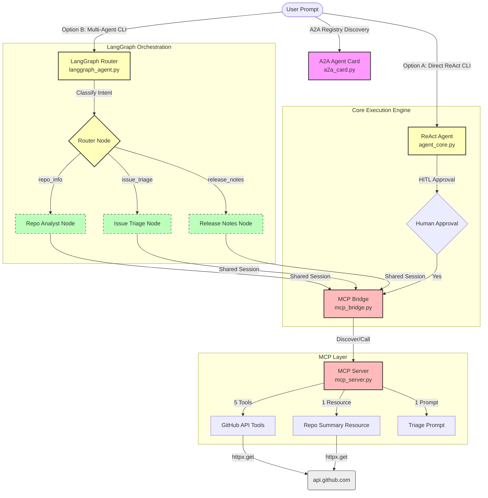

# ⚡ DevPulse

[](https://python.org)
[](https://modelcontextprotocol.io)
[](https://github.com/langchain-ai/langgraph)
[](https://ollama.com)
[](https://groq.com)
[](https://docs.github.com/en/rest)

A capstone reference implementation that dynamically integrates the **Model Context Protocol (MCP)**, a single **ReAct agent**, **LangGraph multi-agent orchestration**, and an **A2A Agent Card** into a single cohesive system backed by the **real, live GitHub REST API**.


---

## 🔍 What It Does

DevPulse is an intelligent GitHub assistant. You ask questions like:
- *"Tell me about facebook/react"*
- *"What are its open issues?"*
- *"Who are its top contributors?"*
- *"Show me its latest release notes"*

It dynamically answers with real, live data fetched from `api.github.com` through a chain of MCP tools, one of three LangGraph specialist agents, and a published A2A Agent Card. 

> [!NOTE]
> **No Mocks!** Every tool call genuinely queries GitHub's REST API. You will observe real rate limits (60/hr unauthenticated → 5,000/hr with a `GITHUB_TOKEN`) and real HTTP error handling.

---

## 🏗️ Architecture Workflow



---

## 📂 Repository Layout

| File | Role & Functionality |
| :--- | :--- |
| **[`mcp_server.py`](file:///e:/Projects/AgenticAI/DevPulse/mcp_server.py)** | FastMCP server exposing **5 tools**, **1 resource**, and **1 prompt**. Connects directly to GitHub via HTTP requests; routes all logs strictly to `stderr`. |
| **[`mcp_client_test.py`](file:///e:/Projects/AgenticAI/DevPulse/mcp_client_test.py)** | Low-level integration test proving the initialization, tool discovery, and invocation protocol without LLM dependency. |
| **[`model_client.py`](file:///e:/Projects/AgenticAI/DevPulse/model_client.py)** | Backend-agnostic LLM connection client supporting local **Ollama** (default) or cloud **Groq** via OpenAI-compatible schema. |
| **[`mcp_bridge.py`](file:///e:/Projects/AgenticAI/DevPulse/mcp_bridge.py)** | Manages the subprocess life cycle, parses FastMCP schemas, and translates tool schemas into OpenAI format. |
| **[`agent_core.py`](file:///e:/Projects/AgenticAI/DevPulse/agent_core.py)** | ReAct agent featuring conversational state/memory and **Human-in-the-Loop (HITL)** runtime approval. |
| **[`langgraph_agent.py`](file:///e:/Projects/AgenticAI/DevPulse/langgraph_agent.py)** | Advanced LangGraph multi-agent setup: a router and three specialists sharing one MCP session. |
| **[`a2a_card.py`](file:///e:/Projects/AgenticAI/DevPulse/a2a_card.py)** | Pydantic model implementing `Skill`, `AgentCard`, and an `AgentRegistry` for agent-to-agent discovery. |
| **[`requirements.txt`](file:///e:/Projects/AgenticAI/DevPulse/requirements.txt)** | Project requirements and libraries (MCP, LangGraph, httpx, openai, pydantic, etc.). |
| **[`.env.example`](file:///e:/Projects/AgenticAI/DevPulse/.env.example)** | Environment variables template. |

---

## 🛠️ Detailed Setup Guide

### Prerequisites
1. **Python 3.10+** (Ensure Python is added to your system path)
2. **Local LLM or API Key**:
   - **Ollama (Recommended)**: Download from [ollama.com](https://ollama.com). Pull the Qwen model: `ollama pull qwen2.5:3b`.
   - **Groq API Key**: Create an API key at [console.groq.com](https://console.groq.com).
3. **GitHub Personal Access Token (PAT)**:
   - Generate a free token at [github.com/settings/tokens](https://github.com/settings/tokens) with public repo permissions.

### Installation

#### 💻 Windows (PowerShell)
```powershell
# Navigate to the directory
cd e:\Projects\AgenticAI\DevPulse

# Create a virtual environment
python -m venv .venv

# Activate the virtual environment
.venv\Scripts\Activate.ps1

# Install dependencies
pip install -r requirements.txt

# Create environmental configuration
Copy-Item .env.example .env
```

#### 💻 Windows (Command Prompt)
```cmd
# Create virtual environment
python -m venv .venv

# Activate the virtual environment
.venv\Scripts\activate.bat

# Install dependencies
pip install -r requirements.txt

# Create environmental configuration
copy .env.example .env
```

#### 🍎 macOS / 🐧 Linux
```bash
# Create virtual environment
python3 -m venv .venv

# Activate the virtual environment
source .venv/bin/activate

# Install dependencies
pip install -r requirements.txt

# Create environmental configuration
cp .env.example .env
```

---

## ⚙️ Environment Configuration

Open the newly created `.env` file and configure it based on your choice of LLM backend:

### Option A: Local Ollama (Default)
```ini
GITHUB_TOKEN=your_github_token_here
LLM_BACKEND=ollama
OLLAMA_BASE_URL=http://localhost:11434/v1
OLLAMA_MODEL=qwen2.5:3b
```
*Make sure Ollama is running in the background before starting:*
```bash
ollama serve
ollama pull qwen2.5:3b
```

### Option B: Cloud Groq
```ini
GITHUB_TOKEN=your_github_token_here
LLM_BACKEND=groq
GROQ_API_KEY=gsk_your_groq_api_key_here
GROQ_MODEL=llama-3.1-8b-instant
```

---

## 🚀 Execution Phases

Execute the following phases to verify, test, and run different portions of the project.

### Phase 1: Verify the MCP Server Independently
Run the raw Python function directly, then run the basic protocol-level client test:
```bash
# Verify the Python function directly
python -c "import mcp_server as s; print(s.get_repo_details('facebook','react'))"

# Verify the raw JSON-RPC client discovery handshake
python mcp_client_test.py
```
*Expected Output:* Raw details for the Facebook React repository and discovery logs displaying available tools.

### Phase 2: Verify the LLM Connection
Test client connectivity to Ollama/Groq:
```bash
python -c "from model_client import get_client_and_model, check_connection; c, m, b = get_client_and_model(); check_connection(c, m, b)"
```
*Expected Output:* Should output `after api call` and return `True` indicating the LLM backend is responsive.

### Phase 3: Run the Single ReAct Agent with HITL
Interact with the single ReAct agent. It has conversational memory and will prompt you to approve each tool execution:
```bash
python agent_core.py
```
**Example Approval Interaction:**
```
============================================================
 HUMAN-IN-THE-LOOP APPROVAL 
============================================================
Tool Selected : get_repo_details
Arguments     : {'owner': 'facebook', 'repo': 'react'}
============================================================
Approve tool execution? (y/n): 
```
*If you type `y`, the tool executes. If you type `n`, execution is denied, and the agent continues reasoning.*

### Phase 4: Run the LangGraph Multi-Agent System
Launch the structured LangGraph orchestrator containing a router and three specialists sharing one MCP session:
```bash
python langgraph_agent.py
```
**Specialist Scopes:**
- **Repo Analyst Node**: Scoped tools: `search_repositories`, `get_repo_details`, `list_contributors`
- **Issue Triage Node**: Scoped tools: `list_open_issues`
- **Release Notes Node**: Scoped tools: `get_latest_release`

*Observe the router logs indicating which node is executing based on your questions!*

### Phase 5: Test the A2A Agent Card Discovery
Simulate an external agent discovering DevPulse's capabilities:
```bash
python a2a_card.py
```
*Expected Output:* Prints the registered Agent Card JSON and shows the agent discovery matches when querying for tags like `'triage'` or `'release'`.

---

## 💡 Key Architectural Concepts

* **Model Context Protocol (MCP)**: Solves *agent-to-tool* communication dynamically via a standardized protocol layer, isolating credentials and access controls.
* **Agent-to-Agent (A2A) Discovery**: Exposes an `AgentCard` outlining capabilities/skills so separate external agents can programmatically discover and task the DevPulse agent.
* **Human-in-the-Loop (HITL)**: Prompts for explicit verification prior to any external tool call, demonstrating how to prevent unintended actions (e.g. data manipulation, cost runs).
* **Multi-Agent Orchestration**: Demonstrates utilizing LangGraph conditional edges to dispatch messages to specific specialists. Each specialist shares a single active MCP session, keeping context shared while restricting available tools to limit LLM hallucination and tool-misuse.

---

## 🛠️ The Two Real Engineering Bugs Documented in the Manual

> [!WARNING]
> ### 1. Environment Variables in Subprocesses (Subprocess Env Leak)
> The MCP client spawns the server as a subprocess using standard libraries. By default, `StdioServerParameters` in python-mcp does **NOT** inherit the parent environment. If you do not pass `env=os.environ.copy()`, the MCP subprocess will run without environment variables, failing to find `GITHUB_TOKEN` and critical CA certificates (like `SSL_CERT_FILE` in sandbox containers).

> [!IMPORTANT]
> ### 2. Standard Output Corrupts Protocol (stdout vs stderr Discipline)
> The MCP stdio transport is strict: `stdout` is reserved **exclusively** for JSON-RPC packets. If you or any library write a standard `print()` inside the server, it pollutes `stdout`, causing the client to crash with:
> `Failed to parse JSONRPC message from server`
> **Rule:** All server logs, connection notices, and warnings must go to `sys.stderr` (e.g., `print("...", file=sys.stderr)`).

---

## 🔍 Troubleshooting Guide

| Symptom | Probable Cause | Corrective Action |
| :--- | :--- | :--- |
| **`GitHub API rate limit exceeded`** | Exceeded the 60 requests/hour unauthenticated limit. | Generate a PAT on GitHub and assign it to `GITHUB_TOKEN` in your `.env` file. |
| **`Failed to parse JSONRPC message from server`** | A stray print or log output was emitted to stdout inside the server. | Ensure all prints in `mcp_server.py` write to `file=sys.stderr`. |
| **`Could not reach Ollama`** | The Ollama local server is either not running or the model isn't pulled. | Run `ollama serve` in a new terminal, and download the model: `ollama pull qwen2.5:3b`. |
| **`Could not reach Groq`** | Invalid or missing API key in the environment. | Set `GROQ_API_KEY` in `.env` and verify you have an active network connection. |
| **`LangGraph specialist ignores context`** | Short-term conversation history is not threaded properly through the state. | Verify `history` is correctly initialized, passed into `graph.invoke()`, and returned from nodes. |

---

## 📄 License & Reference

* **Full Capstone Manual**: Refer to `Final Project DevPulse_Capstone_Manual.pdf` located in the root of this repository. This contains design checklists, grading rubrics, and in-depth details of every engineering choice.
* **Disclaimer**: This codebase is built for educational capstone reference purposes. Use responsibly regarding rate limits and GitHub public API guidelines.
